# Linux Server Hardening & Secure Configuration

## 📌 Project Overview
This project focuses on **hardening a Linux server** by applying security best practices to reduce attack surface, prevent unauthorized access, and protect system integrity.  
The implementation follows the **principle of least privilege**, secure service configuration, and continuous monitoring.

The goal is to demonstrate practical Linux security skills commonly required in **system administration, SOC, and cybersecurity roles**.

---

## 🎯 Objectives
- Secure a Linux system against common attacks
- Minimize exposed services and open ports
- Enforce strong authentication and access control
- Apply firewall rules and system updates
- Monitor logs for suspicious activity

---

## 🛠 Tools & Environment
**Primary OS**
- Ubuntu Server / Kali Linux

**Security Tools**
- UFW (Firewall)
- OpenSSH
- Lynis (Security Auditing)
- CIS Benchmarks (Reference)

---

## 🧭 Project Scope
This project covers:
- User and permission hardening
- SSH security
- Firewall configuration
- Service minimization
- File permission security
- System updates
- Log monitoring
- Security auditing

---

## 🔍 Step-by-Step Implementation

---
## What Is Server Hardening?
Server hardening means protecting your Linux server by reducing its vulnerability surface. It’s like locking every door and window of your house before you go on vacation. You remove unnecessary services, close open ports, and implement security best practices to ensure your server stays safe from intruders.

## Why It Matters?
Even though Linux is considered more secure than many other operating systems, it’s not immune to attacks. Poor configurations, outdated software, or weak passwords can make your server an easy target.


## 1️⃣ Review Default System Settings
Understand the system before making changes.

``bash
### Check OS version
` lsb_release -a`

#### Result:

- OS: Kali GNU/Linux Rolling

- Release: 2025.4

- Codename: kali-rolling

- Purpose:
    Verifying the OS version helps ensure proper patch management and vulnerability assessment. This establishes a secure baseline before applying hardening configurations.

### List users
`cut -d: -f1 /etc/passwd`


#### Result:

- Only system accounts and default service accounts were present.

- No unnecessary or suspicious user accounts detected.

- Purpose:
   Reviewing user accounts ensures the system follows the principle of least privilege and reduces the risk of unauthorized access.

### List running services
`systemctl list-units --type=service`


#### Result:

- Only system accounts and default service accounts were present.

- No unnecessary or suspicious user accounts detected.

- Purpose:
Reviewing user accounts ensures the system follows the principle of least privilege and reduces the risk of unauthorized access.

### Check open ports
`ss -tuln`


#### Result:

- Only port 22 (SSH) was open.

- No additional exposed services.

- Purpose:
Limiting open ports significantly reduces network attack vectors and prevents unauthorized remote access.


## 2️⃣ User Account Hardening

- Remove unused users and restrict privileges.

### Delete unused user
`sudo userdel -r username`

### View sudo users
`getent group sudo` <br>

- Result:

    - Only authorized users were members of the sudo group.

- Purpose:

  - Ensures limited administrative access

  - Enforces the Principle of Least Privilege

  - Reduces risk of privilege escalation
    
### Edit sudo access:

`sudo visudo`


  - ✔ Apply least privilege
  - ✔ Avoid using root for daily tasks

## 3️⃣ Secure SSH Configuration <br>

### 👥 User Privilege Hierarchy (Mermaid Diagram)

```mermaid
graph TD

    ROOT["👑 Root User (UID 0)<br/>Full System Control"]

    KALI["👤 Kali User<br/>(Default Regular User)<br/>UID ≥ 1000"]
    DEV["👨‍💻 Dev User<br/>(Custom Regular User)<br/>UID ≥ 1000"]

    KALI -- "sudo / su" --> ROOT
    DEV -- "sudo / su (if permitted)" --> ROOT


```




## 👥 User Roles Summary

| Feature | Root User | Kali User | Dev User |
|----------|------------|------------|------------|
| UID | 0 | ≥1000 | ≥1000 |
| Purpose | Full system administration | Default daily user | Custom regular user |
| System Control | Full access | Limited | Limited |
| Can Use sudo | Not required | Yes | Only if granted |
| Modify System Files | Yes | With sudo | With sudo (if allowed) |
| Safe for Daily Use | No | Yes | Yes |
| Risk if Compromised | Critical | Medium | Medium |

    ```

- Disable root login and enforce key-based authentication.

`sudo nano /etc/ssh/sshd_config`


## Update the following:

```
PermitRootLogin no
PasswordAuthentication no
PubkeyAuthentication yes
```


### Restart SSH:

`sudo systemctl restart ssh`


### 4️⃣ Update System & Enable Automatic Security Updates
```
sudo apt update && sudo apt upgrade -y
sudo apt install unattended-upgrades -y
sudo dpkg-reconfigure unattended-upgrades
```
- ✔ Keeps system patched
- ✔ Reduces known vulnerabilities

### 5️⃣ Configure Firewall (UFW)
    sudo ufw default deny incoming
    sudo ufw default allow outgoing
    sudo ufw allow ssh
    sudo ufw enable
    sudo ufw status verbose

- Firewall is enabled

- Logging is active (medium level)

- Rules are enforced at boot
  
- Result: Only essential network traffic is allowed.

### 6️⃣ Disable Unnecessary Services
    systemctl list-unit-files --type=service


### Disable unused services:

    sudo systemctl disable servicename
    sudo systemctl stop servicename


- ✔ Reduces attack surface
- ✔ Improves system performance

### 7️⃣ Secure File Permissions

Protect sensitive system files.

### Secure shadow file
    sudo chmod 640 /etc/shadow

### Secure SSH directory
    chmod 700 ~/.ssh
    chmod 600 ~/.ssh/authorized_keys


Goal: Prevent unauthorized file access.

### 8️⃣ Log Monitoring & Auditing
- View authentication logs
  `sudo cat /var/log/auth.log`

### Check system logs
`sudo journalctl -xe`


### (Optional) Install auditing tools:

    sudo apt install auditd -y


- ✔ Detect suspicious activity
- ✔ Improve incident response

### 9️⃣ Security Auditing with Lynis
    sudo apt install lynis -y
    sudo lynis audit system


Lynis provides:

Security score

Hardening recommendations

Compliance checks

## ✅ Linux Hardening Checklist

    Removed unused users

    Restricted sudo access

    Disabled root SSH login

    Enabled SSH key authentication

    Firewall configured (UFW)

    Disabled unused services

    Secured sensitive file permissions

    Enabled automatic updates

    Reviewed system logs

    Performed security audit

## 📄 Security Configuration Summary

SSH hardened with key-based authentication

Firewall restricts inbound connections

System is auto-patched for vulnerabilities

Least privilege enforced

Logs monitored for anomalies

Auditing validates security posture

🏁 Final Outcome

✔ Hardened Linux system
✔ Reduced attack surface
✔ Improved resilience against brute-force, privilege escalation, and misconfiguration attacks

This project demonstrates real-world Linux security hardening skills suitable for cybersecurity portfolios, SOC roles, and system administration.

## 📚 References

- CIS Benchmarks

- Ubuntu Security Documentation

- Lynis Auditing Guide

## 👨‍💻 Author

NATTO MUNI CHAKMA
Cybersecurity Enthusiast | Linux Security | SOC Analyst Path
